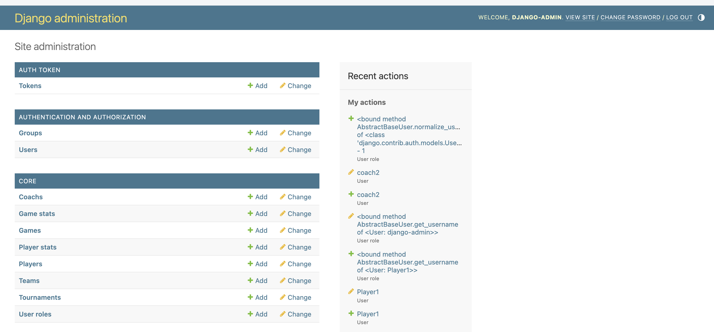
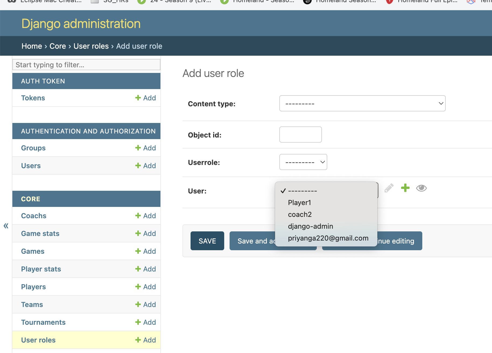
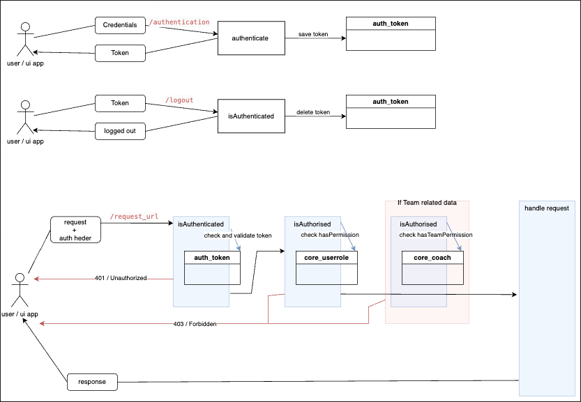

"blms" application for basketball league management Provides below features:

    1. League related
    * Tournament data
    * Games for tournament
    * Coaches
    * Teams
    * Players
    * Dashboard with game results
    * Player stats
    * Team stats
    
    2. Authentication and autherization
    * Retrive auth token with username / password
    * Token based autherization for endpoits (Authorization header token)
    * Team data restrictiononly for coach of the team
    * User stat view for admin
    
How to run  

Python version used : 3.11.6  

DB : SQLite  

1. Checkout the repository;  

    >> git clone https://github.com/priyanga220/matific_blms.git
    
2. cd into the folder  

    >> cd matific_blms
    
3. Use the branch "feature/testDataWithApiAndAdminPanel" 

    >> git checkout feature/testDataWithApiAndAdminPanel
    
4. Apply requirments
    
    >> pip3 install -r requirements.txt
    
5. CD into the Project folder (blms) and Run migrations to apply changes and to create DB 

    >> cd blms
    
    >> python3 manage.py migrate 
    (change python command based on the OS)  
    
    
    This will create the required DB schema. (db.sqlite3)  
    
    
6. Load the test data from "testdata.json" file. This is located in core application inside fixtures folder

    >> python3 manage.py loaddata core/fixtures/testdata.json
    
        This will create some sample data including users to test the application:
        
            * Admin user - this user is django super user with application role "Admin"
                username : django-admin, password : django-admin
                
            * Role : Coach
                username : coach1, password : Djpwd123
                username : coach2, password : Djpwd123
                
            * Role : Player
                username : Player1, password : DJPwd123
    
7. Run the application

    >> python3 manage.py runserver
    
        * django admin panel  ==> http://localhost:8000/admin/ 
        (username : django-admin, password : django-admin)

    
    
Entity Model 

    * core_* tables for blms application data (core_tournament, core_team, core_game, core_coach, core_player, core_playerstat, core_gamestat)
    
    * auth_* tables from django framework for user and authentication management combined with core_userrole and core_userstat tables

    For User <-> Role assignment (Role has direct Link to auth_user through User field and Generic ForiegnKey to [User | Coach | Player] tables 
    
        1. Create (add) the user from django-admin panel -> this will create the auth_user entry
        2. Add new entry in User roles table
            Content-type    :   For Admin role  ->   Select "Authentication and Autherization | user" option
                                For Coach role  ->   Select "Core | coach" option
                                For Player role ->   Select "Core | player" option
                                
            Object id       :   Select the relavant table entry id 
                                (Admin -> auth_user table , Coach -> core_coach table, Player -> core_player table)
                
            Userrole        :   Select the Role
            
            User            :   Select the user which needs to assign the role
    
    
    
    

Endpoints

    Implmented on rest api standards. Should be implmented in a stateless way, but for version 1 authentication is implmented with django auth token approch (for the purpose of login times / online users etc). Token is saved in db. 
    
        Enhancements : Implement authentication with jwt token
    
    port : 8000 . 
    
    
    Endpoints are secured and need to add Authentication token as below;
    
    1. Obtain the auth_token with authentication endpoint
    2. Add Auth header:
        Header name     :   Authorization
        Header value    :   Toke <auth_token>

 
        
URIs . 

1. Authentication  

        HTTP Method     :   POST                                  

        URI             :   /api/v1/authentication/   
        
        Request         :       {    
                                    "username": "django-admin",
                                    "password": "django-admin"

                                } 
        
        Response        :       {
                                    "token": "5384d782a77100000003f3c14e80977f47e8659",
                                    "user_id": 1,
                                    "email": "test@gmail.com"
                                }          
                                
2. Logout
         
        HTTP Method     :   POST                                  

        URI             :   /api/v1/logout/   
        
        Request         :   No Body
        
                            Header => Authorization : Token <tokenvalue>
        
        Response        :       {
                                    "success": "Successfully logged out."
                                } 
                                
                                
3. List Tournaments
         
        HTTP Method     :   GET                                  

        URI             :   /api/v1/tournaments/ 
        
        Request         :   -
        
                            Header => Authorization : Token <tokenvalue>
        
        Response        :       [
                                    {
                                        "id": 2,
                                        "name": "Shgner Cup",
                                        "identifier": "Shgner2024",
                                        "mascot": "Mow Mow"
                                    },
                                    {
                                        "id": 1,
                                        "name": "Wilson International World Cup",
                                        "identifier": "WilsCup2024",
                                        "mascot": "Crazy Frog"
                                    }
                                ]
                                
4. List Games for Tournament
         
        HTTP Method     :   GET                                  

        URI             :   /api/v1/tournaments/<tournamentid>/games
        
        Request         :   -
        
                            Header => Authorization : Token <tokenvalue>
        
        Response        :       [
                                    {
                                        "id": 2,
                                        "game_level": "QU",
                                        "teams": "tre vs tyr",
                                        "game_status": "PL",
                                        "game_time": "2024-06-21 00:00:00"
                                    },
                                    {
                                        "id": 3,
                                        "game_level": "QU",
                                        "teams": "wer vs dse",
                                        "game_status": "CR",
                                        "game_time": "2024-06-20 00:00:00"
                                    },
                                    {
                                        "id": 1,
                                        "game_level": "QU",
                                        "teams": "wer vs dse",
                                        "game_status": "SC",
                                        "game_time": "2024-06-19 00:00:00"
                                    },
                                    {
                                        "id": 4,
                                        "game_level": "QU",
                                        "teams": "tre vs tyr",
                                        "game_status": "CR",
                                        "game_time": "2024-06-19 00:00:00"
                                    }
                                ]
                                
5. Tournament Scoreboard
         
        HTTP Method     :   GET                                  

        URI             :   /api/v1/tournaments/<tournamentid>/scoreboard
        
        Request         :   -
        
                            Header => Authorization : Token <tokenvalue>
        
        Response        :       [
                                    {
                                        "id": 2,
                                        "game_level": "QU",
                                        "teams": "tre vs tyr",
                                        "game_status": "PL",
                                        "game_time": "2024-06-21 00:00:00"
                                    },
                                    {
                                        "id": 3,
                                        "game_level": "QU",
                                        "teams": "wer vs dse",
                                        "game_status": "CR",
                                        "game_time": "2024-06-20 00:00:00"
                                    },
                                    {
                                        "id": 1,
                                        "game_level": "QU",
                                        "teams": "wer vs dse",
                                        "game_status": "SC",
                                        "game_time": "2024-06-19 00:00:00"
                                    },
                                    {
                                        "id": 4,
                                        "game_level": "QU",
                                        "teams": "tre vs tyr",
                                        "game_status": "CR",
                                        "game_time": "2024-06-19 00:00:00"
                                    }
                                ]
                                
6. List teams
         
        HTTP Method     :   GET                                  

        URI             :   /api/v1/teams
        
        Request         :   -
        
                            Header => Authorization : Token <tokenvalue>
        
        Response        :       [
                                    {
                                        "id": 1,
                                        "name": "Black Panthers",
                                        "displayname": "BLKP",
                                        "slogan": "U Can't C M@",
                                        "rank": 1
                                    },
                                    {
                                        "id": 10,
                                        "name": "Boston Celtics",
                                        "displayname": "BSCT",
                                        "slogan": "Yeah",
                                        "rank": 10
                                    },
                                    {
                                        "id": 9,
                                        "name": "Country sides",
                                        "displayname": "CSDS",
                                        "slogan": "Yes We are",
                                        "rank": 9
                                    },
                                    .
                                    .
                                    .
                                    .
                                    {
                                        "id": 3,
                                        "name": "West Indies Super10",
                                        "displayname": "WIS10",
                                        "slogan": "From Windies",
                                        "rank": 3
                                    }
                                ]
                                
7. Team Details with average score
         
        HTTP Method     :   GET                                  

        URI             :   /api/v1/teams/<teamid>
        
        Request         :   -
        
                            Header => Authorization : Token <tokenvalue>
        
        Response        :       {
                                    "teamid": 1,
                                    "name": "Black Panthers",
                                    "displayname": "BLKP",
                                    "slogan": "U Can't C M@",
                                    "rank": 1,
                                    "average_score": 68.75
                                }
                                
8. List players for team
         
        HTTP Method     :   GET                                  

        URI             :   /api/v1/teams/<teamid>/players
        
        Request         :   -
        
                            Header => Authorization : Token <tokenvalue>
        
        Response        :       [
                                    {
                                        "id": 1,
                                        "display_name": "Deems W.",
                                        "height": 6.8,
                                        "rank": 10
                                    },
                                    {
                                        "id": 2,
                                        "display_name": "Jonas Jr.",
                                        "height": 6.8,
                                        "rank": null
                                    },
                                    {
                                        "id": 3,
                                        "display_name": "Temba B.",
                                        "height": 6.1,
                                        "rank": null
                                    }
                                ]
                                
8. List players with for team whose average score is in the 90
percentile across the team
         
        HTTP Method     :   GET                                  

        URI             :   /api/v1/teams/<teamid>/avgpercentileplayers/?percentile=<percentilevalue>
        
                            NOTE : percentile query param is Optional [default=90]
        
        Request         :   -
        
                            Header => Authorization : Token <tokenvalue>
                            
                            Query parameter => percentile  : Optional, if not provide it defaults to 90th percentile
                                        
                                            
        
        Response        :       [
                                    {
                                        "id": 1,
                                        "display_name": "Deems W.",
                                        "height": 6.8,
                                        "rank": 10
                                    }
                                ]
                                
9. Player details - including avg score and no. of games played
         
        HTTP Method     :   GET                                  

        URI             :   /api/v1/players/<playerid>
        
        Request         :   -
        
                            Header => Authorization : Token <tokenvalue>
                                                            
                                            
        
        Response        :       {
                                    "playerid": 1,
                                    "name": "Will Deems",
                                    "display_name": "Deems W.",
                                    "height": 6.8,
                                    "average_score": 115.0,
                                    "num_of_games_played": 2
                                }
                                
8. User stats
         
        HTTP Method     :   GET                                  

        URI             :   /api/v1/userstats
        
        Request         :   -
        
                            Header => Authorization : Token <tokenvalue>
                                        
                                            
        
        Response        :       [
                                    {
                                        "userid": "2",
                                        "first_name": "Amarakoon",
                                        "last_name": "Amarakoon",
                                        "username": "priyanga220@gmail.com",
                                        "user_role": 2,
                                        "totallogins": 2,
                                        "totaltime": "08:53:38.573235"
                                    },
                                    {
                                        "userid": "4",
                                        "first_name": "Coach2",
                                        "last_name": "Coach2",
                                        "username": "coach2",
                                        "user_role": 4,
                                        "totallogins": 2,
                                        "totaltime": "09:32:29.486256"
                                    },
                                    {
                                        "userid": "1",
                                        "first_name": "",
                                        "last_name": "",
                                        "username": "django-admin",
                                        "user_role": 1,
                                        "totallogins": 7,
                                        "totaltime": "09:10:04.090022"
                                    },
                                    {
                                        "userid": "3",
                                        "first_name": "DFG",
                                        "last_name": "DFG",
                                        "username": "Player1",
                                        "user_role": 3,
                                        "totallogins": 13,
                                        "totaltime": "13:53:33.182000"
                                    }
                                ]
    
9. Online Users
         
        HTTP Method     :   GET                                  

        URI             :   /api/v1/onlineusers
        
        Request         :   -
        
                            Header => Authorization : Token <tokenvalue>
                                        
                                            
        
        Response        :       [
                                    {
                                        "first_name": "Dh",
                                        "last_name": "DFG",
                                        "email": "per@gmail.com",
                                        "username": "Player1"
                                    },
                                    {
                                        "first_name": "Priyanga",
                                        "last_name": "Amarakoon",
                                        "email": "priyanga220@gmail.com",
                                        "username": "priyanga220@gmail.com"
                                    },
                                    {
                                        "first_name": "",
                                        "last_name": "",
                                        "email": "priyanga220@gmail.com",
                                        "username": "django-admin"
                                    }
                                ]
                                
10. Coaches list
         
        HTTP Method     :   GET                                  

        URI             :   /api/v1/coaches
        
        Request         :   -
        
                            Header => Authorization : Token <tokenvalue>
                                        
                                            
        
        Response        :      [
                                    {
                                        "name": "Dave Wilson",
                                        "team": "Black Panthers",
                                        "created_date": "2024-06-19T06:49:06.173000Z"
                                    },
                                    {
                                        "name": "Dave Halfmore",
                                        "team": "Super Giants",
                                        "created_date": "2024-06-19T07:29:11.610000Z"
                                    },
                                    {
                                        "name": "Rahul David",
                                        "team": "West Indies Super10",
                                        "created_date": "2024-06-19T06:49:06.173000Z"
                                    },
                                    .
                                    .
                                    .
                                    {
                                        "name": "Harry Kat",
                                        "team": null,
                                        "created_date": "2024-06-19T06:49:06.173000Z"
                                    }
                                ]
                                
                                

Postman Test Collection:

    * blms_local.postman_environment.json
    * blms_matific.postman_collection.json
    
    1. Import the collection and environment into postman
    2. Use blms_local environment 
    3. Set the "host:p" appropriatly. 
    4. Set the token recieved from authentication url into "auth_token".
    
    
Enhancements 

Below poitns are identified and can be implemented as enhancements

    1. Auth flow -> Stateles (REST api Standards) with JWT token authentication -> djangorestframework_simplejwt
    2. Dependancy injection -> DI should be implmented (SOLID Principles) 
        Tried to implment by integrating with "Django-dependency-injector", but configuration needs time
        
    3. logging mechanism - Not focused on any logging in version 1 implementation, Need to implement. 
    
           
        
    

    
    
    
    
    
